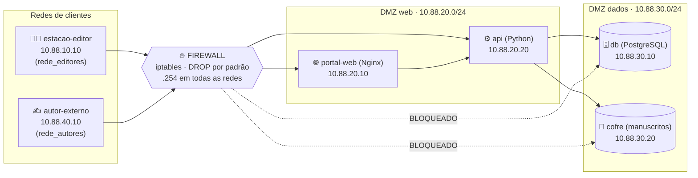

#  Editora Pergaminho: Proteção de Manuscritos Inéditos com Firewall e DMZ

> **Trabalho de Segurança da Informação**: infraestrutura de rede segmentada e segura, simulada integralmente com **Docker Compose**.
>
> **Aluna:** `Janiele de Farias Machado` 

---

## 📑 Sumário

1. [Resumo do projeto](#1-resumo-do-projeto)
2. [Definição do Case](#2-definição-do-case)
3. [Diagnóstico: cenário atual vs. proposta](#3-diagnóstico-cenário-atual-vs-proposta)
4. [Arquitetura da solução](#4-arquitetura-da-solução)
5. [Matriz de regras do firewall](#5-matriz-de-regras-do-firewall)
6. [Como executar (passo a passo)](#6-como-executar-passo-a-passo)
7. [Metodologia de testes e validação (com prints)](#7-metodologia-de-testes-e-validação)
8. [Explicando o código](#8-explicando-o-código)
9. [Estrutura do repositório](#9-estrutura-do-repositório)
10. [Checklist de requisitos do trabalho](#10-checklist-de-requisitos-do-trabalho)
11. [Problemas comuns](#11-problemas-comuns-e-soluções)
12. [Limitações e melhorias futuras](#12-limitações-e-melhorias-futuras)
---

## 1. Resumo do projeto

Uma editora fictícia, a **Editora Pergaminho**, está prestes a lançar o terceiro livro de uma saga de sucesso. Se um capítulo vazar antes da data de lançamento, a empresa perde dinheiro, quebra contratos e prejudica a marca.

Este projeto mostra **como uma rede bem segmentada e um firewall com política "negar tudo por padrão" protegem esse segredo**. Tudo roda em containers Docker, sem precisar de máquinas virtuais ou equipamentos reais.

**Em uma frase:** *ninguém chega ao banco de dados nem aos manuscritos sem passar pelo firewall, e quem passa só chega ao que foi explicitamente autorizado.*

### Explicando como se fosse um prédio

| No projeto | No prédio |
|---|---|
| **Firewall** | A portaria: confere quem entra e para onde vai |
| **Rede dos editores / autores** | A rua e o hall de entrada |
| **DMZ web** (portal + API) | A recepção: atende o público, mas não guarda segredos |
| **DMZ dados** (banco + cofre) | O cofre dos fundos: só o gerente (a API) entra |
| **Regra DROP por padrão** | "Se não está na lista, não entra" |

---

## 2. Definição do Case

### 2.1 A empresa

A **Editora Pergaminho** (empresa hipotética, baseada em riscos reais do mercado editorial) publica literatura nacional. Seu próximo lançamento é *A Sombra do Cerrado, Livro 3*, com **embargo até 15/03/2027**: nenhum trecho pode ser divulgado antes dessa data.

### 2.2 O contexto de negócio

O ativo mais valioso da empresa são os **manuscritos inéditos**. O vazamento de um original pode causar:

-  perda de vendas e de exclusividade no lançamento;
-  quebra de contrato com o autor;
-  dano de reputação junto a livrarias e leitores;
-  exposição de dados pessoais e financeiros (contratos, adiantamentos), com implicações na **LGPD**.

### 2.3 Serviços que precisam funcionar

| Serviço | Quem usa | Função |
|---|---|---|
| **Portal de submissão** | Autores e agentes literários (externos) | Enviar propostas de livros |
| **Painel / API editorial** | Equipe interna (editores, revisores) | Consultar status e ler manuscritos autenticados |
| **Banco de dados (PostgreSQL)** | Somente a API | Autores, contratos, adiantamentos, royalties |
| **Cofre de manuscritos** | Somente a API | Arquivos dos originais em revisão |

---

## 3. Diagnóstico: cenário atual vs. proposta

### 3.1 Cenário atual (problemas mapeados)

Hoje a editora usa uma **rede plana**: todos os computadores e servidores ficam no mesmo segmento.

| # | Problema encontrado | Risco |
|---|---|---|
| 1 | Estações, portal, banco e arquivos no mesmo segmento de rede | Uma máquina comprometida alcança tudo |
| 2 | Banco de contratos acessível a qualquer estação | Vazamento de dados financeiros e pessoais (LGPD) |
| 3 | Pasta de manuscritos sem intermediação nem autenticação | Cópia direta de originais embargados |
| 4 | Portal público na mesma rede da equipe interna | Se o portal for invadido, o invasor "pula" para a rede interna (*pivoting*) |
| 5 | Autores externos enxergam a rede editorial | Varredura de portas (nmap) e movimentação lateral |
| 6 | Nenhum registro de tentativas bloqueadas | Impossível auditar ou detectar reconhecimento |

### 3.2 Proposta de solução

| Decisão de projeto | Por quê |
|---|---|
| **4 redes isoladas** (editores, autores, DMZ web, DMZ dados) | Cada grupo só enxerga o que precisa; uma falha não contamina o resto |
| **DMZ em duas camadas** | Quem fala com o público (portal) fica separado de quem guarda dados (banco, cofre) |
| **A API é a única ponte** entre as camadas | Um único ponto de entrada, autenticado por token, fácil de auditar |
| **Firewall com política DROP por padrão** | O que não foi explicitamente liberado é bloqueado (princípio do menor privilégio) |
| **Regras anti-spoofing** | Impede que alguém "finja" ser de outra rede |
| **Regra anti-pivô** | A DMZ nunca inicia conexão para as redes de clientes |
| **Logs com limite de taxa** (`FW-DROP`) | Auditoria sem encher o disco em caso de ataque |
| **Nginx expõe só 2 rotas da API** | Reduz a superfície de ataque; o resto responde 403 |

---

## 4. Arquitetura da solução

### 4.1 Diagrama



### 4.2 Versão em texto

```
 CLIENTES                     FIREWALL                    DMZ
 ────────                     ────────                    ───
 estacao-editor ──┐                            ┌─ portal-web ─┐
  (equipe)        ├──────►  [ iptables ] ──────┤              ├─► api ─► db
 autor-externo ───┘          DROP por padrão   └──────────────┘      └──► cofre
  (autor de fora)                                  (DMZ web)         (DMZ dados)
```

### 4.3 Containers, redes e IPs

| Container | Rede(s) | IP | Função |
|---|---|---|---|
| `estacao-editor` | rede_editores | 10.88.10.10 | **Cliente interno** (Alpine + curl, nmap, nc) |
| `autor-externo` | rede_autores | 10.88.40.10 | **Cliente externo / não confiável** (Alpine) |
| `firewall` | as 4 redes | 10.88.10/20/30/40.254 | **Gateway e filtro** (`NET_ADMIN`, iptables) |
| `portal-web` | dmz_web | 10.88.20.10 | Nginx: portal de submissão |
| `api` | dmz_web **+** dmz_dados | 10.88.20.20 / 10.88.30.5 | Ponte autenticada entre portal e dados |
| `db` | dmz_dados | 10.88.30.10 | PostgreSQL (dados fictícios) |
| `cofre` | dmz_dados | 10.88.30.20 | Nginx servindo os manuscritos |

> Todas as redes são do tipo **bridge** com `internal: true`: nenhum container tem acesso à internet e **o único caminho entre as redes é o firewall**.

### 4.4 Como os clientes chegam aos serviços (o firewall "publica" a DMZ)

Os clientes **não falam com o IP do servidor**: falam com o **IP do próprio firewall** na rede deles, e o firewall redireciona (DNAT) para o serviço real. Só depois disso a matriz de regras (seção 5) decide se o pacote segue ou é descartado.

| O cliente conecta em… | O firewall encaminha (DNAT) para… | Serviço | Quem pode (matriz) |
|---|---|---|---|
| `10.88.10.254:80` (editor) · `10.88.40.254:80` (autor) | `10.88.20.10:80` | Portal Nginx | Editores (R1) e Autores (R3) ✅ |
| `10.88.10.254:5000` · `10.88.40.254:5000` | `10.88.20.20:5000` | API | Só Editores (R2) ✅ · Autores (R7) 🚫 |
| `10.88.10.254:5432` · `10.88.40.254:5432` | `10.88.30.10:5432` | Banco | Ninguém (R5/R6) 🚫 |
| `10.88.10.254:8080` · `10.88.40.254:8080` | `10.88.30.20:80` | Cofre | Ninguém (R5/R6) 🚫 |

> 💡 **Por que assim?** É o padrão de um firewall real com redirecionamento de portas. Além disso, em versões recentes do Docker (observado na 29.1.5) pacotes endereçados direto ao IP de um container, vindos de *outra* rede, são descartados pelo próprio host antes de chegar ao firewall. Nesse caso o "bloqueio" seria um falso positivo: os contadores do firewall ficariam em zero. Com o DNAT, todo o tráfego passa de fato pelas regras, e **os contadores provam isso**.
>
> Nas regras da seção 5, origem e destino são os valores **depois** do DNAT (IPs reais dos serviços).

---

## 5. Matriz de regras do firewall

Política padrão: **INPUT = DROP · FORWARD = DROP · OUTPUT = DROP**. Tudo o que está abaixo foi liberado ou bloqueado de forma explícita em [`firewall/regras/firewall.sh`](firewall/regras/firewall.sh).

| ID | Origem | Destino | Porta / Protocolo | Ação | Justificativa de negócio |
|---|---|---|---|---|---|
| R0 | Qualquer interface | IP fora da rede esperada / pacotes inválidos | qualquer | **DROP** | Anti-spoofing: ninguém finge ser de outra rede |
| R1 | Rede Editores | Portal (10.88.20.10) | TCP 80 | **ACCEPT** | A equipe usa o portal editorial |
| R2 | Rede Editores | API (10.88.20.20) | TCP 5000 | **ACCEPT** | Painel editorial consulta manuscritos (com token) |
| R3 | Rede Autores | Portal (10.88.20.10) | TCP 80 | **ACCEPT** | Autores enviam propostas |
| R4 | Rede Editores | DMZ web | ICMP echo-request | **ACCEPT** | Diagnóstico de conectividade (ping) |
| R5 | Rede Editores | DMZ dados (db 5432, cofre 80) | qualquer | **DROP + LOG** | Ninguém acessa banco/cofre direto; só a API |
| R6 | Rede Autores | DMZ dados | qualquer | **DROP + LOG** | Externo jamais toca nos dados |
| R7 | Rede Autores | API direta (10.88.20.20) | qualquer | **DROP + LOG** | Autor só passa pelo portal |
| R8 | Rede Autores | Rede Editores | qualquer | **DROP + LOG** | Impede varredura da rede interna |
| R9 | Rede Editores | Rede Autores | qualquer | **DROP + LOG** | A rede interna não inicia conexão com terceiros |
| R10 | DMZ web / DMZ dados | Redes Editores e Autores | novas conexões | **DROP + LOG** | Anti-pivô: servidor invadido não ataca a LAN |
| R11 | Qualquer | Qualquer | ESTABLISHED, RELATED | **ACCEPT** | Permite as *respostas* das conexões já autorizadas |
| R12 | Qualquer | Qualquer | qualquer | **DROP + LOG** | Negação padrão: tudo que sobrou é bloqueado |
| NAT | Redes Editores e Autores | IP do firewall nas portas 80, 5000, 5432, 8080 | DNAT → serviços da DMZ | **REDIRECT** | Publica os serviços no firewall; a filtragem (R1–R12) acontece em seguida |
| INPUT | Rede Editores | O próprio firewall | ICMP echo-request | **ACCEPT** | Testar se o firewall está vivo; todo o resto é DROP |
| OUTPUT | O firewall | Qualquer | , | **DROP** (exceto respostas) | O firewall não inicia conexões |

> 🔎 **Controle dentro da DMZ de dados:** a comunicação `API → db (5432)` e `API → cofre (80)` acontece **dentro** da rede `dmz_dados`, sem atravessar o firewall. Ela é controlada pela **associação de rede**: só a API pertence às duas DMZs ao mesmo tempo.

### Como ler uma regra do `iptables`

```
-A FORWARD -i eth2 -s 10.88.10.0/24 -d 10.88.20.10 -p tcp --dport 80 -m conntrack --ctstate NEW -j ACCEPT
```
> "Pacotes **que entram pela eth2** (rede dos editores), **vindos de** 10.88.10.0/24, **com destino** ao portal (10.88.20.10), **TCP porta 80**, **novas conexões** → **ACEITE**."

---

## 6. Como executar (passo a passo)

### 6.1 Pré-requisitos

- **Docker Desktop** instalado e **aberto** (ícone da baleia verde, "Engine running").
- **Git** (opcional, para clonar).
- No Windows, para o script de testes automático: **Git Bash** ou **WSL** (o `bash`).

### 6.2 Subindo o ambiente

```bash
# 1) Clone o repositório (ou extraia o .zip)
git clone <URL_DO_SEU_REPOSITORIO>
cd editora-pergaminho

# 2) Crie o arquivo de senhas
cp .env.example .env            # Windows (cmd): copy .env.example .env

# 3) Suba tudo (a primeira vez demora alguns minutos)
docker compose up -d --build

# 4) Confira
docker compose ps
```

> O requisito do trabalho pede `docker compose up -d`. O `--build` apenas garante que as imagens do firewall e dos clientes sejam construídas na primeira execução.

**Resultado esperado:** 7 serviços `Up`, e o `firewall` com status **`(healthy)`**.

> 📸 **PRINT 1:** saída de `docker compose ps` com os 7 serviços no ar e o firewall `healthy`.

### 6.3 Desligando

```bash
docker compose down -v      # desliga e apaga volumes (banco volta ao zero)
```

---

## 7. Metodologia de testes e validação

> 💡 **Dica para PowerShell/Windows:** comandos com aspas ficam chatos de digitar. O jeito mais fácil é **entrar no container** e digitar lá dentro:
> ```
> docker compose exec estacao-editor sh
> ```
> Para sair, digite `exit`.

### 7.0 Preparação: provas de que o ambiente está certo

| # | Comando | O que prova | Resultado esperado |
|---|---|---|---|
| 0.1 | `docker network ls --filter name=editora` | As 4 redes bridge existem | `rede_editores`, `rede_autores`, `dmz_web`, `dmz_dados` |
| 0.2 | `docker compose exec firewall cat /proc/sys/net/ipv4/ip_forward` | Encaminhamento de pacotes ligado | `1` |
| 0.3 | `docker compose exec firewall iptables -S \| grep -- "-P"` | Política DROP por padrão | `-P INPUT DROP`, `-P FORWARD DROP`, `-P OUTPUT DROP` |
| 0.4 | `docker compose exec estacao-editor ip route` | Rotas para a DMZ passam pelo firewall | linhas `via 10.88.10.254` |
| 0.5 | `docker compose exec firewall iptables -L FORWARD -n -v --line-numbers` | Regras R0 a R12 carregadas (contadores zerados) | 20 linhas de regra |

> 📸 **PRINT 2:** `docker network ls --filter name=editora`
> 📸 **PRINT 3:** `ip_forward` = 1 **e** as políticas `-P ... DROP` (pode ser no mesmo print)
> 📸 **PRINT 4:** `iptables -L FORWARD -n -v --line-numbers` **antes dos testes** (contadores em 0)
> 📸 **PRINT 5:** `ip route` da estação do editor (rotas passando pelo firewall) e, junto, `docker compose exec firewall iptables -t nat -L PREROUTING -n` (as 8 regras de DNAT)

---

### 7.1 ✅ Testes positivos (o que DEVE funcionar)

| ID | Quem testa | Comando | Resultado esperado | Regra |
|---|---|---|---|---|
| **P1** | Editor → Portal | `docker compose exec estacao-editor curl -s -o /dev/null -w "%{http_code}\n" http://portal-web/` | `200` | R1 |
| **P2** | Editor → Portal → API | `docker compose exec estacao-editor curl -s http://portal-web/api/health` | `{"status": "ok"}` | R1 |
| **P3** | Editor → API (porta 5000) | `docker compose exec estacao-editor curl -s http://api-editorial:5000/status` | `{"api": "ok", "db": "up", "cofre": "up"}` | R2 |
| **P4** | Editor lê manuscrito (com token) | `docker compose exec estacao-editor curl -s -H "X-API-Token: troque-este-token" http://api-editorial:5000/manuscritos/a-sombra-do-cerrado-cap01.txt` | Texto do capítulo (contém `FLAG{...}`) | R2 |
| **P5** | Editor → ping no firewall | `docker compose exec estacao-editor ping -c 2 10.88.10.254` | 0% de perda | INPUT |
| **P6** | Autor → Portal | `docker compose exec autor-externo curl -s -o /dev/null -w "%{http_code}\n" http://portal-web/` | `200` | R3 |
| **P7** | Autor envia proposta (POST) | *(dentro do container)* `curl -s -X POST -H "Content-Type: application/json" -d '{"titulo":"Meu livro"}' http://portal-web/api/submissao` | `{"protocolo": "...", "mensagem": "Proposta recebida..."}` | R3 |

> `portal-web` e `api-editorial` são apelidos que apontam para o IP do firewall (`10.88.10.254` para o editor, `10.88.40.254` para o autor).

> 📸 **PRINT 6:** P1, P2 e P3 no mesmo terminal (editor acessando o portal e a API)
> 📸 **PRINT 7:** P4 (manuscrito lido **com** token) e, logo abaixo, a mesma chamada **sem** token, que retorna `{"erro": "token invalido"}`
> 📸 **PRINT 8:** P6 e P7 (autor acessando o portal e enviando a proposta)

---

### 7.2 🚫 Testes negativos (o que DEVE ser bloqueado)

| ID | Quem testa | Comando | Resultado esperado | Regra |
|---|---|---|---|---|
| **N1** | Editor → **Banco** | `docker compose exec estacao-editor nmap -Pn -p 5432 10.88.10.254` | `5432/tcp filtered` | R5 |
| **N2** | Editor → Banco (conexão) | `docker compose exec estacao-editor nc -zv -w 3 10.88.10.254 5432` | *timeout* (não conecta) | R5 |
| **N3** | Editor → **Cofre** | `docker compose exec estacao-editor curl -sS -m 3 http://10.88.10.254:8080/` | `Connection timed out` | R5 |
| **N4** | Autor → **API direta** | `docker compose exec autor-externo curl -sS -m 3 http://10.88.40.254:5000/status` | `Connection timed out` | R7 |
| **N5** | Autor → Banco | `docker compose exec autor-externo nmap -Pn -p 5432 10.88.40.254` | `filtered` | R6 |
| **N6** | Autor → ping no firewall | `docker compose exec autor-externo ping -c 2 -W 2 10.88.40.254` | `100% packet loss` | INPUT (só editores) |
| **N7** | Autor tenta ler manuscrito pelo portal | `docker compose exec autor-externo curl -s -o /dev/null -w "%{http_code}\n" http://portal-web/api/manuscritos/a-sombra-do-cerrado-cap01.txt` | `403` | Nginx |
| **N8** | Autor → rota interna da API | `docker compose exec autor-externo curl -s -o /dev/null -w "%{http_code}\n" http://portal-web/api/status` | `403` | Nginx |
| **N9** | Autor varre o firewall | `docker compose exec autor-externo nmap -Pn -p 22,80,443,5000,5432,8080 10.88.40.254` | só a **80 `open`**; as demais `filtered` | R3, R6, R7 + INPUT |
| **N10** | Portal tenta alcançar a LAN | `docker compose exec portal-web wget -T 3 -qO- http://10.88.10.10` | falha (sem rota) | R10 (defesa extra) |
| **N11** | Editor tenta **contornar** o firewall (IP interno do banco) | `docker compose exec estacao-editor nc -zv -w 3 10.88.30.10 5432` | *timeout* | isolamento de rede |

> 📸 **PRINT 9:** N1 (o `nmap` mostrando `5432/tcp filtered`): **o print mais importante do trabalho**
> 📸 **PRINT 10:** N3 e N4 (timeouts do cofre e da API direta)
> 📸 **PRINT 11:** N6 (ping com 100% de perda) e N9 (só a porta 80 aberta)
> 📸 **PRINT 12:** N7/N8 retornando `403`

#### 📖 Como interpretar o `nmap`

| Estado | Significado |
|---|---|
| `open` | Porta aberta, serviço respondeu |
| `closed` | Máquina respondeu "não há serviço aqui" |
| **`filtered`** | **Nenhuma resposta: um firewall descartou o pacote** ✅ (é o que queremos ver no banco) |

---

### 7.3 📊 Evidência: contadores do firewall

Depois dos testes negativos, mostre que **o firewall realmente descartou os pacotes**:

```bash
docker compose exec firewall iptables -L FORWARD -n -v --line-numbers
```

**Resultado esperado:** as linhas das regras **R5, R6 e R7** (DROP) com valores **maiores que 0** na coluna `pkts`, e as de ACCEPT (**R1, R2 e R3**) também com tráfego, vindo dos testes positivos. As regras R8, R9, R10 e R12 podem continuar em 0, porque nenhum teste tenta chegar nelas.

> 📸 **PRINT 13:** a tabela de contadores **depois** dos testes, ao lado do PRINT 4 (antes). A diferença entre os dois comprova que o firewall está filtrando.
>
> ⚠️ Se **todos** os contadores continuarem em `0`, o tráfego não está passando pelo firewall. Veja [Problemas comuns](#11-problemas-comuns-e-soluções).

#### (Opcional) Logs de bloqueio `FW-DROP`

Em **Linux** (host real), habilite o log por namespace e acompanhe:

```bash
sudo sysctl -w net.netfilter.nf_log_all_netns=1
sudo dmesg -w | grep FW-DROP
```
> No Docker Desktop (Windows/macOS) o log de kernel fica dentro da VM do Docker; use os **contadores** acima como evidência.

---

### 7.4 🧪 Teste automático (tudo de uma vez)

```bash
bash testes/validar.sh
```

O script executa **7 testes positivos + 11 negativos + 6 conferências de contadores** (as regras R1, R2, R3, R5, R6 e R7 precisam ter contado pacotes). Imprime `[PASS]`/`[FAIL]` e mostra a tabela do firewall ao final.

**Resultado esperado:** `Resultado: 24 passaram, 0 falharam.`

> 📸 **PRINT 14:** a saída completa do `validar.sh` com o placar final (24 passando).

---

### 7.5 🔬 Contraprova: o firewall é o único caminho

Para provar que **não existe atalho** entre as redes, desligue o firewall e repita um teste positivo:

```bash
docker compose stop firewall
docker compose exec estacao-editor curl -sS -m 3 http://portal-web/     # deve FALHAR (o firewall é o gateway)
docker compose start firewall                                            # religa
```

**Resultado esperado:** com o firewall desligado, **nada** se comunica; ao religar, volta a funcionar.

> 📸 **PRINT 15:** o `curl` falhando com o firewall parado.

---

### 7.6 📋 Resumo dos prints sugeridos

| Print | O que mostrar | Seção do relatório |
|---|---|---|
| 1 | `docker compose ps` (7 serviços, firewall healthy) | Execução |
| 2 | `docker network ls` (4 redes) | Arquitetura |
| 3 | `ip_forward = 1` e políticas DROP | Firewall |
| 4 | Regras R0 a R12 com contadores zerados | Matriz de regras |
| 5 | `ip route` do cliente | Isolamento |
| 6 | P1, P2, P3 (editor acessando portal/API) | Testes positivos |
| 7 | P4 com e sem token | Testes positivos |
| 8 | P6, P7 (autor no portal) | Testes positivos |
| 9 | **N1: nmap `filtered` no banco** | Testes negativos |
| 10 | N3, N4 (timeouts) | Testes negativos |
| 11 | N6, N9 (ping perdido, só porta 80 aberta) | Testes negativos |
| 12 | N7, N8 (403) | Testes negativos |
| 13 | Contadores **depois** dos testes | Evidência |
| 14 | `validar.sh` com 24 passando | Validação |
| 15 | Contraprova (firewall parado) | Validação |
| 16 | `git log --oneline --graph` | Repositório |
| 17 | Conteúdo do `docker-compose.yml` (redes e `cap_add`) | Código |

> 💾 Sugestão: salve os prints em `docs/prints/` com nomes como `01-compose-ps.png`, `09-nmap-filtered-db.png` e referencie no relatório.

---

## 8. Explicando o código

### 8.1 `docker-compose.yml`

```yaml
firewall:
  build: ./firewall
  cap_add: [NET_ADMIN]              # permissão para mexer em rotas e iptables
  sysctls:
    net.ipv4.ip_forward: "1"        # liga o roteamento entre as redes
  volumes:
    - ./firewall/regras:/etc/firewall:ro   # regras editáveis sem refazer a imagem
  healthcheck: ...                  # só fica "healthy" depois de carregar as regras
  networks:                         # conectado às 4 redes, com IP .254 em cada uma
```

- **Redes explícitas:** as 4 redes são declaradas no final do arquivo com `driver: bridge`, `internal: true` e sub-redes fixas.
- **IPs fixos:** facilitam escrever as regras do firewall e os testes.
- **`depends_on: firewall: service_healthy`:** os clientes só sobem **depois** que as regras estão ativas.
- **`extra_hosts`:** como os clientes não compartilham rede com a DMZ, o Docker não resolveria `portal-web`. O mapeamento aponta o nome para o **IP do firewall** na rede do cliente (ex.: `portal-web → 10.88.10.254`), e o firewall faz o DNAT para o serviço real.

### 8.2 `firewall/entrypoint.sh`: carrega as regras sozinho

```sh
echo 1 > /proc/sys/net/ipv4/ip_forward   # garante o encaminhamento
sh /etc/firewall/firewall.sh              # aplica as regras do iptables
touch /tmp/firewall.ready                 # sinaliza "pronto" ao healthcheck
exec tail -f /dev/null                    # mantém o container vivo
```

### 8.3 `firewall/regras/firewall.sh`: as regras (resumo)

1. Descobre as interfaces de rede pelo prefixo de IP (`eth0`, `eth1`...).
2. Limpa tudo e define **`-P INPUT/FORWARD/OUTPUT DROP`**.
3. Cria a chain `LOGDROP` (registra com limite de taxa e descarta).
4. Aplica as regras R0 → R12 **na ordem** (a ordem importa: vale a primeira que casar).
5. Publica os serviços com **DNAT** (`PREROUTING`): 80 → portal, 5000 → API, 5432 → banco, 8080 → cofre.
6. Configura `MASQUERADE` para o retorno do tráfego da DMZ.

Para **recarregar as regras sem reiniciar** o ambiente:
```bash
docker compose exec firewall sh /etc/firewall/firewall.sh
```

### 8.4 Demais componentes

| Arquivo | O que faz |
|---|---|
| `cliente/entrypoint.sh` | Instala as rotas das outras redes **via firewall** (papel que o DHCP faria) |
| `portal/nginx.conf` | Libera só `/api/health` e `/api/submissao`; o resto vira 403 |
| `api/app.py` | API em Python (só biblioteca padrão): `/health`, `/status`, `/manuscritos/<arquivo>` (exige token) e `/submissao` |
| `db/init.sql` | Cria as tabelas e insere dados **fictícios** |
| `cofre/manuscritos/` | Manuscrito de demonstração com uma `FLAG`: se alguém a ler fora da API, o firewall falhou |
| `testes/validar.sh` | Executa todos os testes e imprime o placar |

---

## 9. Estrutura do repositório

```
editora-pergaminho/
├── docker-compose.yml          # redes, containers, IPs, capabilities, volumes
├── .env.example                # modelo de senha/token (copie para .env)
├── README.md                   # este arquivo
├── firewall/
│   ├── Dockerfile
│   ├── entrypoint.sh           # carrega as regras ao subir
│   └── regras/firewall.sh      # regras iptables (R0 a R12)
├── cliente/
│   ├── Dockerfile              # Alpine + curl, nmap, nc, iproute2
│   └── entrypoint.sh           # rotas via firewall
├── portal/
│   ├── nginx.conf
│   └── html/index.html
├── api/app.py
├── db/init.sql
├── cofre/manuscritos/
├── testes/validar.sh
└── docs/
    ├── RELATORIO.md
    └── prints/                 # evidências (screenshots)
```

---

## 10. Checklist de requisitos do trabalho

| Requisito do enunciado | Atendido? | Onde |
|---|---|---|
| Rede Cliente (LAN) com container Alpine (curl, nmap...) | ✅ | `estacao-editor` (`cliente/Dockerfile`) |
| Container Firewall como gateway entre as redes | ✅ | `firewall` (conectado às 4 redes) |
| `cap_add: [NET_ADMIN]` | ✅ | `docker-compose.yml` |
| `net.ipv4.ip_forward=1` | ✅ | `sysctls` no compose + `entrypoint.sh` |
| iptables com **DROP por padrão** + liberações explícitas | ✅ | `firewall/regras/firewall.sh` |
| Rede DMZ com serviços (Nginx, API, banco isolado) | ✅ | `portal-web`, `api`, `db`, `cofre` |
| Redes bridge isoladas e personalizadas no Compose | ✅ | bloco `networks:` do compose |
| Cliente não acessa a DMZ sem passar pelo firewall | ✅ | redes `internal: true` + rotas via firewall |
| Script de inicialização carrega as regras sozinho | ✅ | `firewall/entrypoint.sh` |
| Volumes mapeados quando necessário | ✅ | regras, HTML, config Nginx, banco |
| Seção 1: Definição do Case | ✅ | [Seção 2](#2-definição-do-case) |
| Seção 2: Diagnóstico atual vs. proposta | ✅ | [Seção 3](#3-diagnóstico-cenário-atual-vs-proposta) |
| Seção 3: Matriz de regras | ✅ | [Seção 5](#5-matriz-de-regras-do-firewall) |
| Seção 4: Metodologia de testes (positivos e negativos) | ✅ | [Seção 7](#7-metodologia-de-testes-e-validação) |
| Git com commits organizados | 🔲 | [Seção 13](#13-histórico-de-commits-sugerido) |
| README com `docker compose up -d` | ✅ | [Seção 6](#6-como-executar-passo-a-passo) |

---

## 11. Problemas comuns e soluções

| Sintoma | Causa provável | Solução |
|---|---|---|
| `Pool overlaps with other one on this address space` | Outra rede Docker já usa `10.88.x.x` | Rode `docker network ls`/`docker network prune` ou troque o prefixo `10.88.` por outro (ex.: `10.99.`) no compose, no `firewall.sh` e no `validar.sh` |
| `Cannot connect to the Docker daemon` | Docker Desktop fechado | Abra o Docker Desktop e aguarde ficar verde |
| Firewall não fica `healthy` | Erro ao carregar as regras | `docker compose logs firewall` |
| **Todos os contadores do firewall em 0** e os `curl` positivos falham | O tráfego não está passando pelo firewall | Confirme `docker compose exec firewall cat /proc/sys/net/ipv4/ip_forward` (`1`) e se os testes usam o **IP do firewall** (`portal-web`, `10.88.10.254:...`) e **não** o IP interno do servidor. Veja a seção 4.4 |
| Subi o projeto antigo e nada funciona | Versão anterior sem DNAT | `docker compose down -v` e suba de novo com os arquivos atualizados |
| `bash: command not found` no Windows | Sem Git Bash/WSL | Use os testes manuais da seção 7 |
| Aspas dão erro no PowerShell | PowerShell trata aspas de forma diferente | Entre no container: `docker compose exec estacao-editor sh` |
| Mudei o `.env` e nada mudou | Container usa o valor antigo | `docker compose up -d --force-recreate` |

> ⚠️ **Interpretando os testes negativos:** um bloqueio só vale como **prova** se os testes positivos funcionam (a rede está de pé) **e** os contadores das regras de DROP aumentam. Sem isso, "bloqueado" pode significar apenas "sem conexão".

---

## 12. Limitações e melhorias futuras

- **TLS/HTTPS:** a simulação usa HTTP (porta 80). Em produção: certificado e porta 443.
- **Autenticação de usuários** no portal e no painel (hoje há apenas um token de API).
- **IDS/IPS (Suricata):** gerar alertas de varredura em tempo real.
- **IP de origem nos logs dos servidores:** a DMZ enxerga o IP do firewall por causa do NAT (`MASQUERADE`).
- **Regras R4, R8, R9 e R10** existem como defesa em profundidade, mas não são exercitadas pelos testes, pois a topologia do Docker já impede esses caminhos (sem rota). Os contadores delas ficam em 0.
- **nftables:** migrar as regras do `iptables` para o `nftables`.
- **Centralização de logs** (ex.: Loki/Grafana) para auditoria contínua.
- **Cliente com `NET_ADMIN`:** usado apenas para instalar rotas (papel do DHCP); em produção isso não seria necessário.

---


<p align="center">Feito por Janiele</p>
